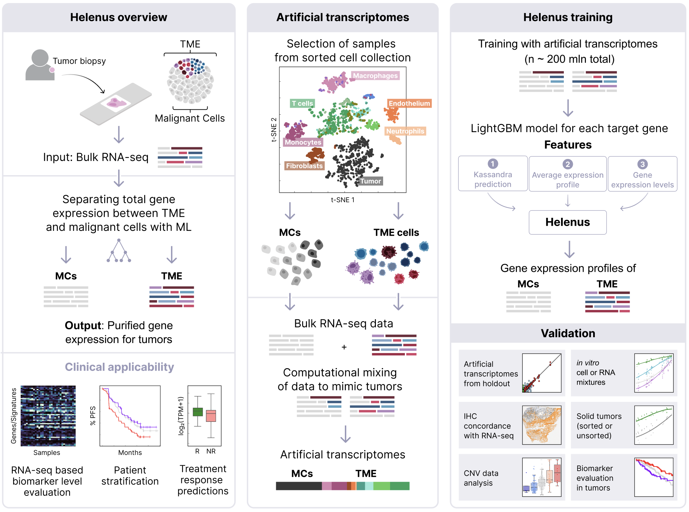

# README #

Trained models: https://science.bostongene.com/helenus/

## Table of Contents
<!-- TABLE OF CONTENTS -->

 
Table of Contents

 <ol>
   <li>
     <a href="#about-the-project">About The Project</a>
   </li>
   <li>
     <a href="#getting-started">Getting Started</a>
       <ul>
           <li><a href="#Data">Data</a></li>
       </ul>
       <ul>
           <li><a href="#Model training">Model training</a></li>
       </ul>
       <ul>
           <li><a href="#Data processing">Data processing</a></li>
       </ul>
   </li>
   <li>
     <a href="#publication">Publication</a>
   </li>
   <li>
     <a href="#license">License</a>
   </li>
 </ol>

## About The Project

**Helenus** is a machine learning-based tool designed to separate gene expression between malignant cells (MCs) and tumor microenvironment (TME) cells from bulk RNA sequencing (RNA-seq) data. By accurately distinguishing the origin of gene expression, Helenus enhances biomarker interpretation, which is critical for understanding tumor biology and advancing personalized cancer care. Building on the cell deconvolution capabilities of Kassandra (Zaitsev et al., Cancer Cell, 2022), Helenus addresses the challenge of heterogeneous tumor biopsies, where TME cells often dominate and mask MC-specific gene expression.

## Getting started
### Data
### Model training
### Data processing 

## Publication
coming soon.

## Licencse 
BY UTILIZING THE CODE, YOU ARE CONSENTING TO BE AND AGREE TO BE BOUND BY ALL OF THE TERMS OF THIS LIMITED LICENSE, SEE "LICENSE.txt"