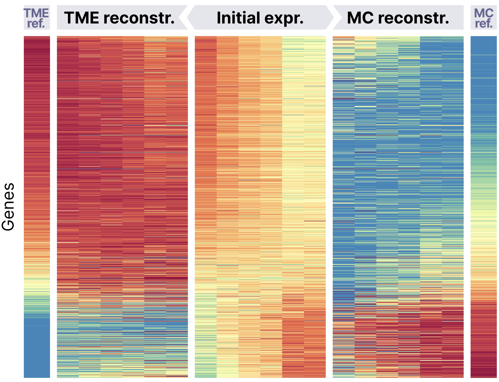

# README #

### What is this repository for? ###

* Creating and visualizing data for microenvironment expression subtraction: creating pseudobulks from single-cell data, scatterplots and heatmaps before and after subtraction etc.

### Who do I talk to? ###

* Valentina Belyaeva, Boris Shpak, Katay Ivleva, Daniil Litvinov

### Installation

`tumor_profile` library can be installed as a Python package via pip using following command:

`pip install --extra-index-url https://nexus.bostongene.internal/repository/pypi-all/simple git+https://[YOUR_BITBUCKET_USER_NAME]@bitbucket.org/bostongene/tumor_profile.git`

It is possible that you will get an error assotiatated with `pygraphviz` library. Then at first you should run the following command:

`sudo apt-get install graphviz libgraphviz-dev pkg-config`

And then run the first command again.
